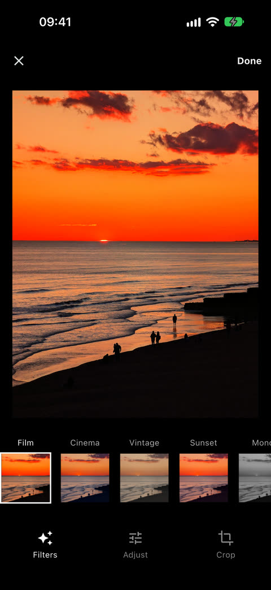
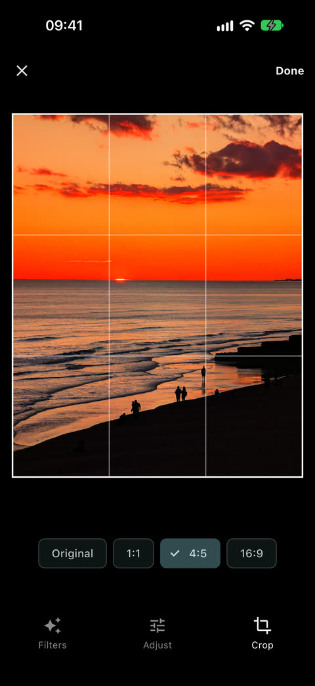
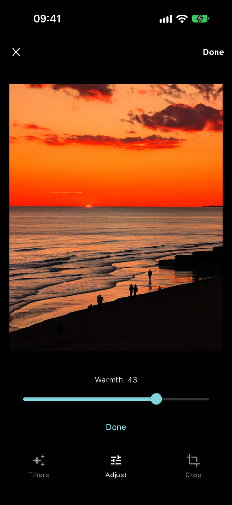
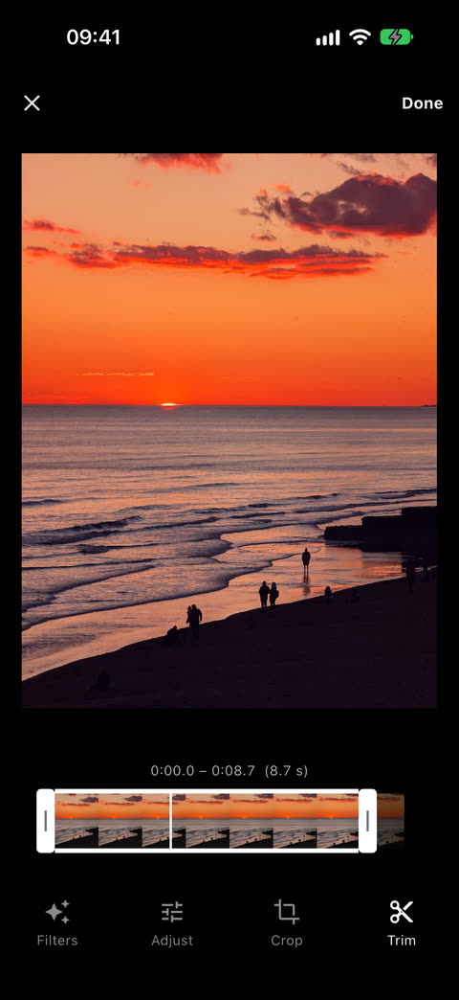

# filmkit

Photo and video editing for Flutter: crop, trim, LUT filters and adjustments, exported natively (Media3 Transformer on Android, AVFoundation on iOS), with an Instagram-style editor screen.

> **Status**: 0.7, Instagram-style editor with re-editing, and headless video and photo export (trim, crop, resize, LUT filters). Tested on Android (Pixel 8a, emulator) and the iOS simulator.

## Editor

<p>
  
  
  
  
</p>

<sub>Photo: <a href="https://commons.wikimedia.org/wiki/File:Brighton_beach_at_sunset_2025-02-27.jpg">Brighton beach at sunset</a>, Wikimedia Commons, CC0.</sub>

```dart
final result = await FilmkitEditor.open(context, path: file.path);
if (result != null) {
  print(result.export!.path); // the exported MP4 or JPEG
  print(result.edit);         // the EditSpec, to export again later
}
```

- Tools: filters (tap again for the intensity), adjustments (brightness, contrast, saturation, warmth), crop (ratios, pan and pinch-zoom), trim for videos.
- `EditorOptions`: the looks offered (`looks:`, default `Looks.builtIn`), the crop ratios (`aspects:`), `export: false` to only get the `EditSpec`, `outputPath`, `maxDimension` (1080 by default), `quality`, `keepLocation`, `minDuration` / `maxDuration` of the trim, and `texts:` to translate the labels (`EditorTexts`). Both have a `copyWith`.
- Your own filters: `Look('Name', await CubeLut.fromFile(path))` or `Look.generate('Name', (r, g, b) => ...)`.
- Reopen the editor where the user left off: save `result.state.toJson()` (an `EditorState`), and pass `EditorState.fromJson(...)` as `initialState:` to `FilmkitEditor.open` on the same file.
- `FilmkitEditor.open(title:)` shows a title in the app bar, e.g. "2/4" when editing several files in a row.
- `FilmkitEditorPage` is the screen itself, for apps that handle navigation themselves. `CropView` is the crop tool's view (a `CropState` over any child), e.g. for a crop preview in a picker.
- Adjustments only change colors, so they are baked into the look's LUT: the exporters only ever apply one table. The result's `edit.lut` is that combined table, written to the temporary directory.

## With a picker

filmkit doesn't include a picker. [filmkit_picker](https://pub.dev/packages/filmkit_picker) is its companion: an Instagram-style gallery with a crop preview, single or multiple selection. It opens the editor on each picked media, starting from the crop chosen in the picker (see the [example](example/lib/main.dart)):

```dart
final results = await FilmkitPicker.pickAndEdit(
  context,
  options: const PickerOptions(maxCount: 10),
  editorOptions: const EditorOptions(maxDimension: 1080),
);
```

Any other picker works too: pass the file path to `FilmkitEditor.open`. If that picker has a crop, `CropState.fromRect` turns its ratio and normalized area into an `initialState` for the editor.

## Video export

```dart
final export = Filmkit.exportVideo(
  input: '/path/to/input.mp4',
  output: '/path/to/output.mp4',
  edit: const EditSpec(
    trimStart: Duration(seconds: 1),
    trimEnd: Duration(seconds: 4),
    crop: Rect.fromLTRB(0, 0.2, 1, 0.8), // normalized, as the video is displayed
    maxDimension: 1080,                  // longest output side, never upscaled
  ),
);
export.progress.listen((p) => print('${(p * 100).round()} %'));
try {
  final result = await export.result; // path, width, height
} on FilmkitException catch (e) {
  // e.code: invalidInput, cancelled, hdrUnsupported, exportFailed
}
// export.cancel() stops it and deletes the partial file.
```

## Photo export

```dart
final result = await Filmkit.exportImage(
  input: '/path/to/photo.heic',
  output: '/path/to/photo.jpg',
  edit: const EditSpec(crop: Rect.fromLTRB(0, 0.1, 1, 0.9), maxDimension: 2048, lut: '/path/to/look.cube'),
  quality: 90,           // JPEG quality
  keepLocation: false,   // GPS metadata removed by default
);
```

- Input: JPEG, HEIC, PNG, WebP… Output: an sRGB JPEG.
- The EXIF orientation is applied to the pixels, and the crop is in the displayed orientation, as for videos.
- Capture date, camera, lens and exposure metadata are kept; the location only if `keepLocation` is true.

## Filters

Filters are 3D LUTs in `.cube` files (Resolve, Photoshop, Lightroom…), applied with the same result by the preview and the export.

```dart
final look = await CubeLut.fromFile('/path/to/look.cube');

// Live preview on any widget: an image, a video player…
LutFilter(lut: look, intensity: 0.8, child: VideoPlayer(controller));

// Export
Filmkit.exportVideo(input: input, output: output, edit: const EditSpec(lut: '/path/to/look.cube', lutIntensity: 0.8));
Filmkit.exportImage(input: photo, output: jpeg, edit: const EditSpec(lut: '/path/to/look.cube', lutIntensity: 0.8));
```

- `CubeLut.generate` builds a table from a function, `encode()` writes it as `.cube`.
- `Filmkit.getVideoFrame(path, position: …, maxDimension: …)` returns a frame as a `ui.Image` (e.g. for filter thumbnails).
- `LutFilter` needs Impeller (the default on Android and iOS); without it the child is shown unfiltered.

- Input and output are file paths. With a photo_manager `AssetEntity`, use `await asset.file`.
- The output is an MP4 (H.264 + AAC), SDR: HDR sources are tone mapped by the platform (Media3 on Android, AVFoundation on iOS), so the result differs slightly between the two. Phone videos (HLG) convert well on both; Android renders them a little darker. With HDR10 (PQ) sources, Android adds a slight pink cast to bright grays, and iOS clips bright saturated colors, which can change their hue (a bright sky turns cyan). Some Android devices can't tone map HDR; the export then fails with `hdrUnsupported`.
- Crop coordinates are in the displayed orientation (rotation tag applied), so a rect drawn over a preview can be passed as is.
- `Filmkit.getVideoInfo(path)` returns the displayed size, duration, and audio / HDR flags.
- `EditSpec` is serializable (`toJson` / `EditSpec.fromJson`).

Requirements: Android API 24+, iOS 15+.

## Principles

- The editing UI is Flutter; everything that produces a file is native.
- Filters are 3D LUTs, shared by the live preview (Flutter shader) and the native export, so that the preview and the exported file look the same.
- Edits are described by a serializable `EditSpec`, exportable with or without the editor screen.
- Picker-agnostic input: a file path, from filmkit_picker or any other picker.

## Development

- Dart tests: `flutter test` (the editor screen runs against a fake `FilmkitPlatform` and video player, see `test/fakes.dart`).
- CI (`.github/workflows/ci.yml`): format, analysis and Dart tests; Android build and Kotlin unit tests; the integration tests on an Android emulator and, through XCTest with the `RunnerTests`, on an iOS simulator.
- Native tests: `./gradlew :filmkit:testDebugUnitTest` in `example/android`; `RunnerTests` in `example/ios` (`xcodebuild test -workspace Runner.xcworkspace -scheme Runner -destination 'platform=iOS Simulator,name=<device>' -only-testing:RunnerTests/RunnerTests`: the `RunnerTests` class only).
- On iOS simulators, `flutter test integration_test` often never sees the app start (flutter/flutter#181771). The RunnerTests target also runs the integration tests through XCTest (`RunnerTests/IntegrationTests.m`), which is what the CI does:
  1. In `example`, `flutter build ios --config-only --simulator --debug integration_test/all_test.dart`.
  2. `xcodebuild test` as above, with `-only-testing:RunnerTests`. The integration tests then show up as `IntegrationTests` cases.
- Export tests on a device: `flutter test integration_test -d <device>` in `example`, with the sample videos of `example/assets/videos` (colored quadrants and a gray band that encodes time, a color gradient) and photos of `example/assets/photos` (a gradient, the quadrant pattern in the 8 EXIF orientations with metadata), see `example/lib/sample_videos.dart`). They compare the export and the preview with the CPU reference pixel by pixel.
- On the Android emulator, add `--dart-define=EMULATOR=true`: its graphics layer converts BT.709 video frames with the BT.601 matrix, which shifts the colors of every Media3 export there (test `export keeps the source colors`).
